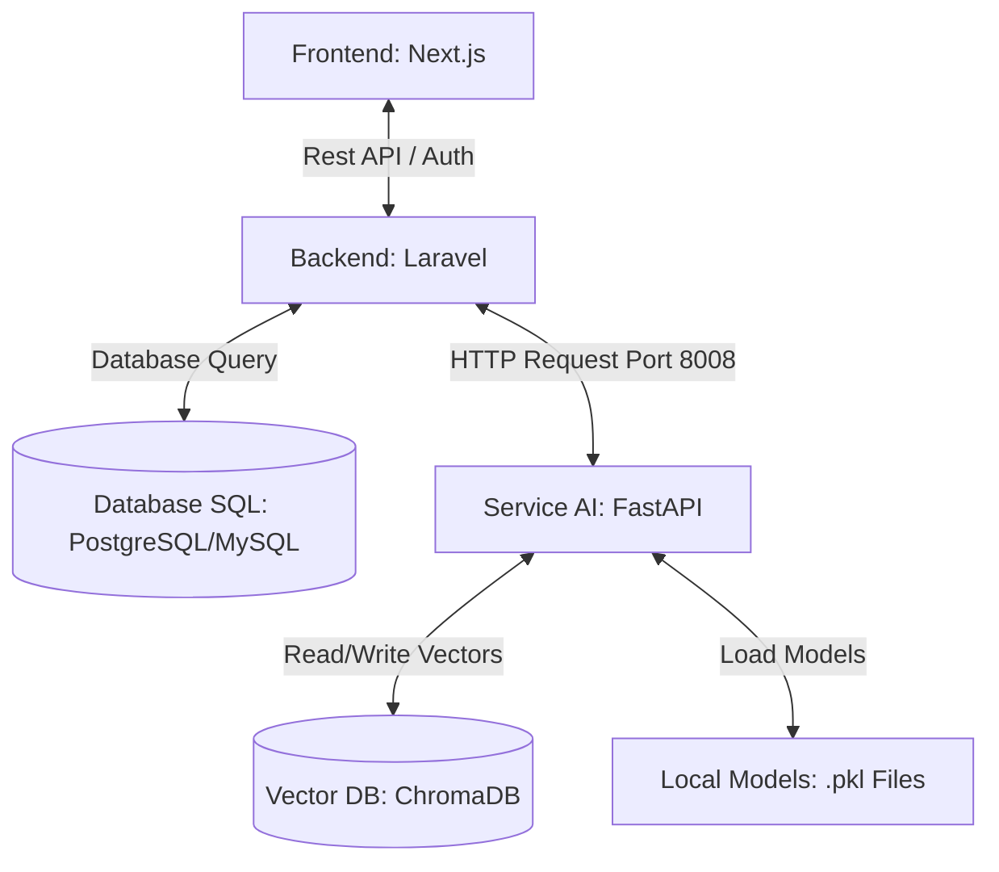

# Catatan Pembuatan & Pengembangan AI BakuLink 🧠

Dokumen ini berfungsi sebagai peta jalan (roadmap) dan arsitektur referensi untuk pengembangan fitur Artificial Intelligence pada aplikasi **BakuLink**.

---

## 🗺️ Arsitektur Integrasi Sistem BakuLink

Sistem BakuLink terbagi menjadi 3 komponen utama yang saling berkomunikasi secara real-time:

    
---

## 🌟 Fitur AI Utama & Langkah Pembuatannya

### 1. Price & Demand Forecasting (Peramalan Harga & Permintaan)
Fitur ini memproyeksikan harga komoditas pangan pokok strategis untuk 7 hingga 30 hari ke depan guna membantu UMKM dan Supplier merencanakan pembelian/penjualan.

*   **Dataset:** Menggunakan data historis dari web PIHPS Bank Indonesia / Bapanas (rentang data minimal 3 tahun terakhir agar musiman/pattern tahunan terekam).
*   **Algoritma:** SARIMAX (untuk model linier musiman) atau Prophet dari Meta (lebih toleran terhadap missing data dan hari libur).
*   **Langkah Pembuatan:**
    1. Latih model di **Google Colab** menggunakan Python.
    2. Lakukan evaluasi nilai error (MAE, RMSE, MAPE < 10%).
    3. Ekspor model terlatih menggunakan `pickle` atau `joblib` menjadi berkas `.pkl`.
    4. Simpan berkas tersebut ke folder `bakulink-service-ai/models/`.
    5. Buat API endpoint `/predict-price` di FastAPI untuk membaca berkas `.pkl` dan mengembalikan nilai proyeksi harga.

---

### 2. Procurement AI Advisor (Asisten Pengadaan Pintar)
Asisten chatbot interaktif yang membantu pengguna mengoptimalkan rantai pasok, memahami regulasi pangan nasional, dan memberikan rekomendasi pembelian cerdas.

*   **Konsep Arsitektur:** **Hybrid RAG (Retrieval-Augmented Generation)**.
*   **Statis/Semi-Statis (ChromaDB):**
    - Dokumen kebijakan harga eceran tertinggi (HET) komoditas.
    - Standar kualitas komoditas dari BSN (Badan Standardisasi Nasional).
    - Artikel cara negosiasi dan manajemen rantai pasok pangan.
*   **Dinamis (Database SQL via Laravel Tool Calling):**
    - Harga bahan pangan termurah hari ini di sekitar pembeli.
    - Status stok gudang pemasok terdekat.
*   **Langkah Pembuatan:**
    1. Buat script embedding teks menggunakan library `sentence-transformers` atau API OpenAI/Gemini di Python.
    2. Lakukan proses *indexing* (menyimpan potongan teks dokumen ke dalam `chroma_db/`).
    3. Di FastAPI, buat endpoint `/advisor` yang menerima input pesan chat dari pengguna.
    4. Cari dokumen relevan di ChromaDB menggunakan *Similarity Search*.
    5. Kirim potongan dokumen tersebut bersama instruksi pesan ke LLM (seperti Gemini Flash 1.5 / GPT-4o-mini) sebagai konteks jawaban.
    6. Kirim jawaban akhir kembali ke Laravel/Next.js.

---

## 🛠️ Strategi Sinkronisasi Data Dinamis (Agar ChromaDB Selalu Terkini)

Untuk memastikan AI Advisor mengetahui jika ada **Pemasok Baru** atau **Produk Baru** tanpa harus melakukan *rebuild* seluruh ChromaDB:

1.  **Gunakan Incremental Sync:**
    Buat route `/ai/sync` di FastAPI. Setiap kali ada penambahan produk/pemasok di Laravel, gunakan Event/Observer Laravel untuk menembak endpoint tersebut secara latar belakang (Background Queue) untuk meng-update koleksi data vektor ChromaDB secara instan menggunakan method `collection.upsert()`.
2.  **Gunakan API Tooling (Rekomendasi Utama untuk Data Transaksional):**
    Berikan akses kepada LLM untuk melakukan *Function Calling*. Saat user bertanya tentang harga pasar real-time di BakuLink, AI secara otomatis akan menembak REST API Laravel (bukan mencari di ChromaDB) untuk menjamin akurasi data harga rupiah hingga 100% tepat.

---

## 📅 Roadmap Pengembangan Lanjutan

*   [ ] **Fase 1: Eksperimen Data** (Menganalisis pola pergerakan harga pangan di Google Colab dan melatih model peramal).
*   [ ] **Fase 2: Deployment Model** (Mengekspor file `.pkl` dan menaruhnya ke folder `models/`).
*   [ ] **Fase 3: Integrasi RAG** (Memasukkan dokumen referensi hukum pangan / panduan bisnis ke `chroma_db/` dan menyambungkan LLM API).
*   [ ] **Fase 4: Pembuatan UI Chatbot** (Membuat visualisasi grafik peramalan tren harga di Next.js dan ruang obrolan chat interaktif dengan AI Advisor).
